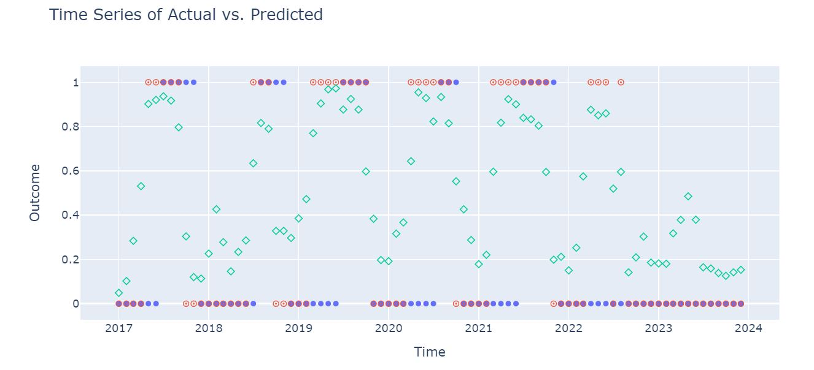

## DryPredict 🌍💧
DryPredict is a predictive modeling tool designed to forecast drought-related administrative measures across diverse territories. 
This project aims to empower proactive water management and climate resilience strategies through advanced AI and data science techniques.

